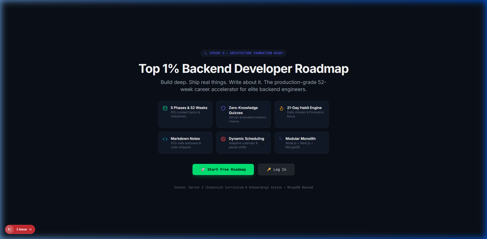
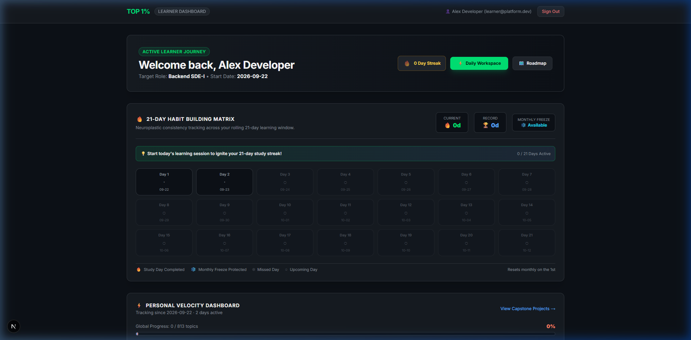
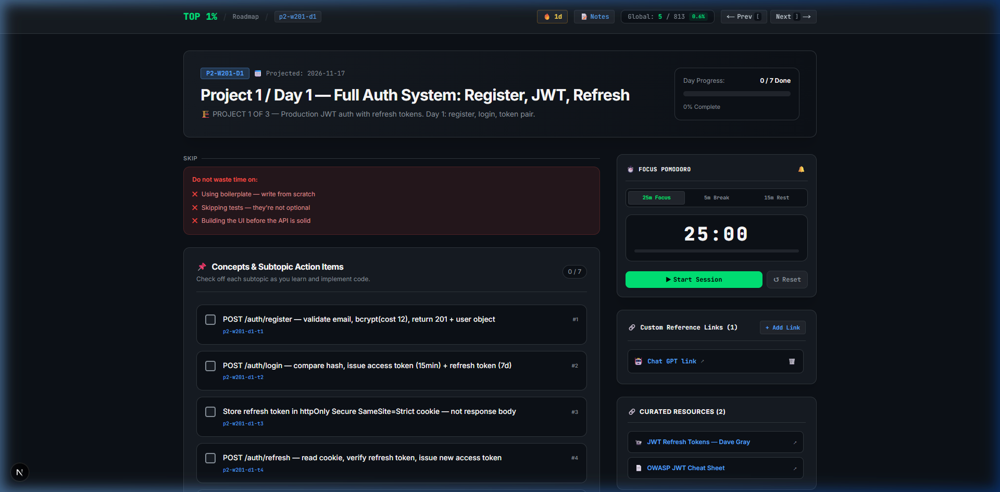
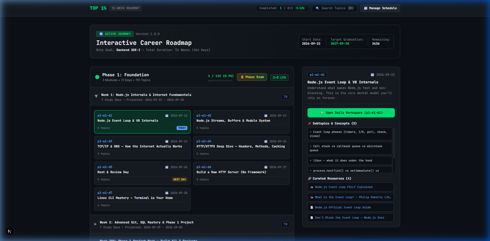
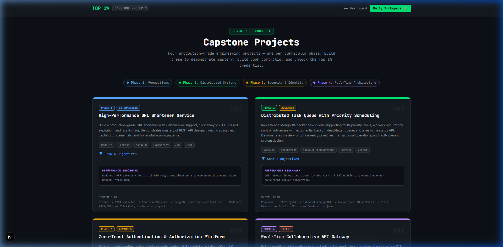
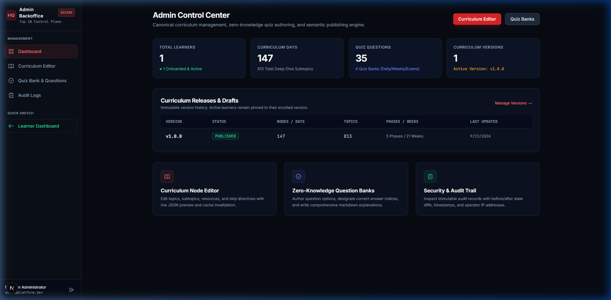

# 🚀 Top 1% Backend Developer Roadmap Platform — User Guide

Welcome to the **Top 1% Backend Developer Roadmap Platform**, a comprehensive 52-week career accelerator designed to transform aspiring software engineers into world-class, production-grade backend specialists.

This guide provides an end-to-end walkthrough of the platform, including local setup instructions, pre-seeded demo accounts, feature breakdowns for learners and administrators, and architectural highlights.

---

## 📋 Table of Contents

1. [Quickstart & Running Locally](#1-quickstart--running-locally)
2. [Demo Login Credentials](#2-demo-login-credentials)
3. [Learner Experience Walkthrough](#3-learner-experience-walkthrough)
   - [Landing Page & Authentication](#landing-page--authentication)
   - [Adaptive 3-Step Onboarding](#adaptive-3-step-onboarding)
   - [Learner Command Dashboard (`/dashboard`)](#learner-command-dashboard-dashboard)
   - [Daily Learning Workspace (`/workspace`)](#daily-learning-workspace-workspace)
   - [Interactive Curriculum Roadmap (`/curriculum`)](#interactive-curriculum-roadmap-curriculum)
   - [Zero-Knowledge Quiz Runner](#zero-knowledge-quiz-runner)
   - [Notes Explorer (`/notes`)](#notes-explorer-notes)
   - [Capstone Projects Hub (`/projects`)](#capstone-projects-hub-projects)
4. [Administrator Backoffice (`/admin`)](#4-administrator-backoffice-admin)
   - [Admin Control Center](#admin-control-center)
   - [Curriculum Node Editor](#curriculum-node-editor)
   - [Version Publisher Engine](#version-publisher-engine)
   - [Zero-Knowledge Quiz Management](#zero-knowledge-quiz-management)
   - [Security & Immutable Audit Trail](#security--immutable-audit-trail)
5. [Troubleshooting & FAQs](#5-troubleshooting--faqs)

---

## 1. Quickstart & Running Locally

The platform is architected as a monorepo consisting of:
- **Backend**: Express + TypeScript + MongoDB Atlas + Redis (fallback in-memory caching) running on `http://localhost:5000`
- **Frontend**: Next.js 15 (App Router) + Tailwind CSS + Zustand running on `http://localhost:3000`
- **Shared Package**: `@top1/shared` containing cross-boundary DTOs, schemas, and types

### Starting the Servers

From the root directory (`d:\Backend_dev\Backend_Roadmap_hosted`):

```bash
# Terminal 1: Start Backend API (Port 5000)
npm run dev:backend

# Terminal 2: Start Frontend Web App (Port 3000)
npm run dev:frontend
```

### Running Automated Test Suites

```bash
# Run all backend unit, integration, and QA validation suites (235+ tests)
cd backend && npm test
```

---

## 2. Demo Login Credentials

The MongoDB database is seeded with ready-to-use demo accounts for testing both perspectives:

| Role | Email Address | Password | Permissions & Scope |
| :--- | :--- | :--- | :--- |
| **Learner** | `learner@platform.dev` | `Password123!` | Full access to Learner Dashboard, 147 Days of Workspace, Quizzes, Notes, Streaks, Capstones, and Roadmap. |
| **Administrator** | `admin@platform.dev` | `AdminPassword123!` | Administrative Backoffice, Curriculum Node Editor, Version Publisher, Question Banks, and Audit Trail. |

---

## 3. Learner Experience Walkthrough

### Landing Page & Authentication
- **URL**: `http://localhost:3000`
- **Design**: Modern dark aesthetic with interactive CTAs, curriculum preview, milestone breakdown, and feature highlights.
- **Login / Register**: `http://localhost:3000/login` and `http://localhost:3000/register`.
- **Security Features**:
  - `HttpOnly`, `SameSite=Lax` JWT dual-token cookies (Access Token + Refresh Token).
  - Double-Submit CSRF cookie protection (`x-csrf-token`).
  - IP-based sliding-window rate limiting.



---

### Adaptive 3-Step Onboarding
- **URL**: `http://localhost:3000/onboarding`
- Triggered automatically for any new learner account before accessing the curriculum.
1. **Target Milestone Selection**: Choose career goal (`3–8 LPA SDE-I`, `8–15 LPA Backend Specialist`, `15–30 LPA Senior Backend`, or `30+ LPA Staff / Lead Architect`).
2. **Start Date & Velocity Setup**: Pick start date and customize pacing (`0.5x Extended`, `1.0x Standard`, `1.5x Accelerated`, `2.0x Intensive`).
3. **Pace & Track Confirmation**: Review dynamic graduation projection and personalized daily schedule.

---

### Learner Command Dashboard (`/dashboard`)
- **URL**: `http://localhost:3000/dashboard`
- **Key Widgets**:
  - **Telemetry Summary**: Global progress counter (e.g., `1 / 813 Topics Completed`), active day indicator, and target graduation date.
  - **Velocity Widget**: Displays current completion velocity, projected completion date, and buffer days ahead/behind schedule.
  - **21-Day Habit Formation Matrix & Strict Streak Rules**:
    - **Strict Day Completion Requirement**: A calendar day qualifies toward your daily streak **ONLY** when **all subtopics of that study day are completed AND the day-wise quiz has been submitted**. Partial topic checks or note saves alone do not qualify as a streak day.
    - **Anchored to Program Start Date**: Day 1 of the 21-Day Habit Matrix anchors directly to your onboarding `startDate` (e.g. `2026-09-22`), showing Day 1 as `09-22`, Day 2 as `09-23` (Today), and Days 3 through 21 as `Upcoming` (`○`).
    - **True Longest Streak (Record 🏆)**: Both `currentStreak` and `longestStreak` (Record) are deterministically computed strictly from verified qualifying completions. Stale or unearned records are eliminated.
    - **Streak Freezes & Grace Window**: 24-hour grace window to study before streak resets, plus 1 automatic monthly streak freeze for unexpected interruptions.
    - **Habit Formation**: Visual 21-day neuroplastic consistency tracker showing active, frozen, missed, and upcoming days.
  - **Phase Progression Cards**: High-level progress breakdown across all 5 curriculum phases with direct links to continue learning.
  - **Legacy Migration Banner**: Allows learners switching from Notion, Google Sheets, or local notes to import previous completions seamlessly.



---

### Daily Learning Workspace (`/workspace`)
- **URL**: `http://localhost:3000/workspace` or `http://localhost:3000/workspace?day=p1-w1-d1`
- The daily focal point where learners study, take notes, and complete tasks.
- **Core Components**:
  1. **Canonical Header**: Displays phase, week, day index, today badge, and keyboard shortcuts (`[` for previous day, `]` for next day).
  2. **SKIP Anti-Patterns Banner ("Do not waste time on:")**:
     - Highlights curated traps, premature optimizations, and time-wasters to avoid during project and intensive weeks (e.g., `✕ Using boilerplate — write from scratch`, `✕ Skipping tests — they're not optional`, `✕ Building the UI before the API is solid`).
     - Directly derived from the authoritative curriculum blueprint to maximize learning velocity.
  3. **Subtopic Action Items**:
     - Check off granular concepts as you learn them.
     - **Optimistic UI Updates**: State changes immediately on screen while syncing asynchronously with the backend.
  4. **Daily Quiz Trigger**: Start the 5-question zero-knowledge daily quiz to test retention.
  5. **Focus Pomodoro Timer**:
     - Built-in timer with `25m Focus`, `5m Short Break`, and `15m Long Break` presets.
     - Audio notification on interval completion.
  6. **Custom Reference Links**: Save links to external articles, GitHub repositories, or ChatGPT explanations for future review.
  7. **Curated Resources**: Direct links to video lectures, official documentation, and deep-dive blog posts.
  8. **Daily Markdown Notes**:
     - Full markdown editor with instant preview.
     - Debounced autosave (saves automatically 1.5s after typing stops).
     - **Optimistic Concurrency Control (OCC)**: Prevents accidental overwrites across tabs using document version incrementing.



---

### Interactive Curriculum Roadmap (`/curriculum`)
- **URL**: `http://localhost:3000/curriculum`
- **Features**:
  - Full hierarchical tree of **5 Phases, 21 Weeks, 147 Days, and 813 Topics**.
  - Collapsible/expandable week modules.
  - Day cards with status badges (`TODAY`, `REST DAY`, `COMPLETED`, `UPCOMING`).
  - **Command Palette (`Cmd+K` / `Ctrl+K`)**: Global search modal allowing instant fuzzy-filtering across all 813 curriculum topics with one-click direct navigation.
  - **Schedule Adjustment Modal**: Recalibrate start dates or adjust target pace on the fly.



---

### Zero-Knowledge Quiz Runner
- Accessible from the Workspace (`START QUIZ`) or Curriculum (`Phase Exam`).
- **Security Architecture**:
  - Question options and text are served without correct answer markers.
  - Answers are submitted to `/api/v1/quizzes/:id/submit` and graded server-side against an isolated, encrypted answer key.
  - High scores, attempt counts, pass/fail status, and detailed markdown explanations are recorded upon completion.

---

### Notes Explorer (`/notes`)
- **URL**: `http://localhost:3000/notes`
- Centralized knowledge vault containing all personal markdown notes taken across all 147 days.
- Instant client-side search filtering by topic title, canonical ID, or note content.

---

### Capstone Projects Hub (`/projects`)
- **URL**: `http://localhost:3000/projects`
- Four production-grade projects that benchmark real-world backend engineering capabilities:
  1. **Phase 1 (Intermediate): High-Performance URL Shortener Service**
     - *Stack*: Node.js, Express, MongoDB, TypeScript, Zod, Jest.
     - *Benchmark*: P99 redirect latency < 5ms at 10,000 req/s.
  2. **Phase 2 (Advanced): Distributed Task Queue with Priority Scheduling**
     - *Stack*: Node.js, TypeScript, MongoDB Transactions, Express, Vitest.
     - *Benchmark*: 500 jobs/sec sustained ingest with < 0.01% duplicate processing.
  3. **Phase 3 (Advanced): Zero-Trust Authentication & Authorization Platform**
     - *Stack*: Node.js, TypeScript, Redis, Argon2, Jose, Jest.
     - *Benchmark*: Token refresh P99 < 15ms with replay attack revocation.
  4. **Phase 4 (Expert): Real-Time Collaborative API Gateway**
     - *Stack*: Node.js, WebSocket (ws), Redis Pub/Sub, TypeScript, Supertest.
     - *Benchmark*: 5,000 concurrent WebSockets with message distribution P95 < 20ms.



---

## 4. Administrator Backoffice (`/admin`)

- **URL**: `http://localhost:3000/admin`
- **Access**: Restricted strictly to users with the `admin` role (`admin@platform.dev`). Any non-admin attempting access receives a customized 403 Forbidden screen.



### Key Capabilities

1. **Admin Control Center**: Real-time overview of active enrolled learners, published curriculum nodes, total questions, and active curriculum semantic version.
2. **Curriculum Node Editor**:
   - Edit any of the 147 curriculum nodes, module titles, and descriptions.
   - Add/reorder subtopics and update curated resource links.
   - Toggle rest days and optional milestones.
3. **Version Publisher Engine**:
   - Manage curriculum releases using Semantic Versioning (`v1.0.0`, `v1.1.0`, etc.).
   - Publish draft modifications to make them live for new learners while preserving immutable pinned versions for existing learners.
4. **Zero-Knowledge Quiz Management**:
   - Manage question banks, multiple-choice options, correct answer indices, and markdown explanations.
5. **Security & Immutable Audit Trail**:
   - Every administrative modification (curriculum node updates, version publishes, quiz updates) writes an immutable record to the audit ledger.
   - Records operator user ID, IP address, timestamp, action type, and before/after diff payload.

---

## 5. Troubleshooting & FAQs

### Q: The workspace or dashboard was showing a continuous loading spinner. How was it resolved?
**A:** On fresh tab opens or hard page refreshes, client-side state in Zustand initializes with `isLoading: true`. We added an `AuthInitializer` component in `RootLayout` (`frontend/app/layout.tsx`) and enhanced the workspace lifecycle so that `/auth/me` is verified automatically upon mount. If an active session cookie exists, the workspace renders immediately; if not, it cleanly redirects to `/login`.

### Q: How do I test the rate limiter?
**A:** The backend enforces rate limits on public authentication endpoints (100 requests per 15-minute window for standard endpoints; 5 requests per 15-minute window on failed login attempts). If exceeded, the API returns `429 Too Many Requests` with a `Retry-After` header.

### Q: How does Google OAuth authenticate and remember existing users?
**A:** When learners sign in with Google, the platform exchanges the authorization code directly with Google's OAuth2 endpoints (`https://oauth2.googleapis.com/token` and `https://www.googleapis.com/oauth2/v3/userinfo`). It retrieves the real Google user ID (`sub`), verified email, name, and profile picture. If the user already exists (or registered previously with that email), the platform links the account and recognizes their `isOnboarded` status—returning learners go directly to `/dashboard` without repeating onboarding.

### Q: How does the Render keep-alive GitHub Action prevent free tier spin-down?
**A:** On Render's free tier, services spin down after 15 minutes of inactivity. The repository includes an automated GitHub Action workflow (`.github/workflows/keep-alive.yml`) scheduled to ping `${{ vars.BACKEND_URL }}/health` every 10 minutes (`*/10 * * * *`). This keeps the backend awake 24/7 with zero cold starts.

---

*Enjoy your journey to becoming a Top 1% Backend Engineer!*
