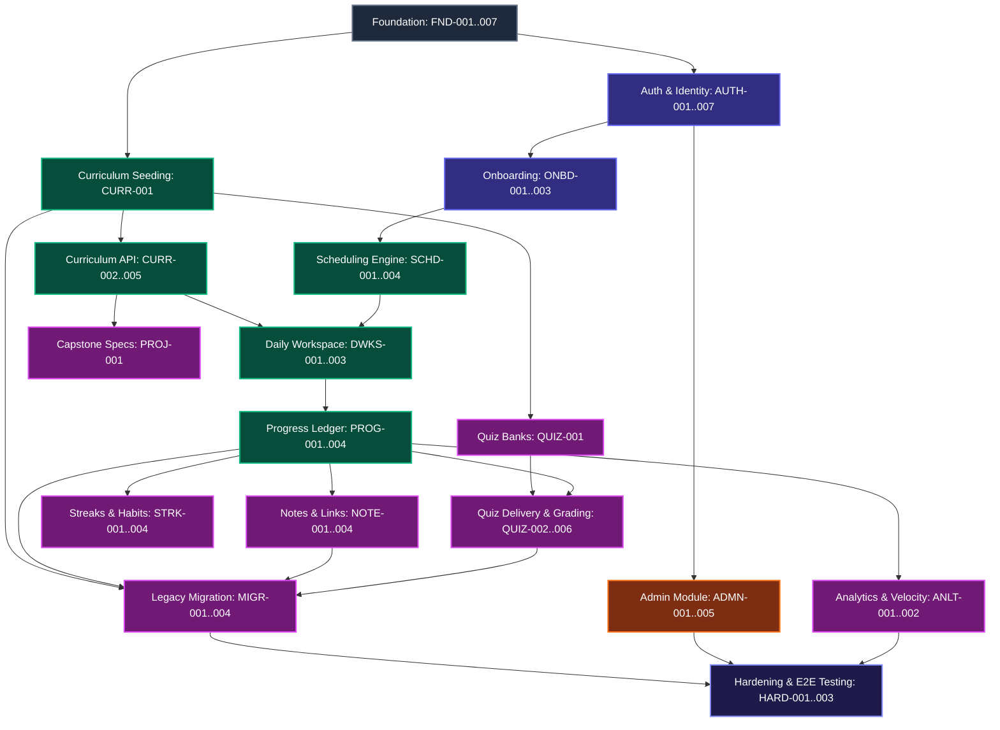

# 36. Story Dependency Map & Implementation Ordering

**Project:** Top 1% Backend Roadmap Platform  
**BMAD Phase:** Phase 5 — Scrum Master Planning  
**Role:** BMAD Scrum Master  
**Status:** Approved Dependency Graph  

---

## 1. High-Level Domain Dependency Graph

---

## 2. Detailed Prerequisite & Story Dependency Table

| Story ID | Story Title | Direct Prerequisites | Unblocks |
| :--- | :--- | :--- | :--- |
| **FND-001** | Monorepo Structure & TypeScript Setup | *None (Root)* | FND-002, FND-004, FND-006, FND-007 |
| **FND-002** | Express Backend Bootstrap & Env Validation | FND-001 | FND-003, FND-005, AUTH-001 |
| **FND-003** | MongoDB Connection & Mongoose Setup | FND-002 | CURR-001, AUTH-001, QUIZ-001 |
| **FND-004** | Next.js App Router & Tailwind Theme | FND-001 | AUTH-006, ONBD-002, CURR-003, DWKS-001 |
| **FND-005** | Centralized Error Handling & Pino Logging | FND-002 | AUTH-001, API controllers |
| **FND-006** | Shared Type Contracts & API Envelope | FND-001 | AUTH-001, CURR-001, Frontend API clients |
| **FND-007** | Testing Pipeline Configuration | FND-001, FND-002 | All Unit/Integration/E2E test suites |
| **AUTH-001** | User Registration API & Password Hashing | FND-002, FND-003, FND-006 | AUTH-002, AUTH-004 |
| **AUTH-002** | Dual-Token Cookie Auth & Session Store | AUTH-001 | AUTH-003, AUTH-005, ONBD-001, PROG-001 |
| **AUTH-003** | Google OAuth 2.0 Integration | AUTH-002 | AUTH-006 |
| **AUTH-004** | Password Reset Flow via Email Tokens | AUTH-001 | AUTH-006 |
| **AUTH-005** | RBAC Middleware & CSRF Double-Submit | AUTH-002 | ADMN-001, Mutating API routes |
| **AUTH-006** | Frontend Auth Screens (Login/Register) | FND-004, AUTH-001, AUTH-002 | AUTH-007, E2E auth flows |
| **AUTH-007** | Auth State Provider & Axios Interceptors | AUTH-002, AUTH-006 | ONBD-003, Authenticated learner pages |
| **ONBD-001** | Onboarding Data Model & Schedule Init API | AUTH-002, CURR-001 | ONBD-002, ONBD-003, SCHD-001 |
| **ONBD-002** | Interactive Onboarding Wizard UI | FND-004, ONBD-001 | ONBD-003 |
| **ONBD-003** | Learner Setup Routing Guard & Hydration | AUTH-007, ONBD-001 | Protected learner workspace access |
| **CURR-001** | Canonical Curriculum Schema & Seeding | FND-003, FND-006 | CURR-002, SCHD-001, MIGR-002 |
| **CURR-002** | Curriculum Hierarchy Read API & Cache | CURR-001 | CURR-003, CURR-004, DWKS-001 |
| **CURR-003** | Interactive Roadmap View & Accordion | FND-004, CURR-002 | CURR-004, CURR-005 |
| **CURR-004** | Curriculum Search & Command Palette | CURR-003 | Global navigation |
| **CURR-005** | Resource Links & Skip Directives | CURR-003 | DWKS-002 |
| **SCHD-001** | Dynamic Calendar Calculation Engine | ONBD-001, CURR-001 | SCHD-002, SCHD-003, DWKS-001 |
| **SCHD-002** | Reschedule Schedule API & Date Shift | SCHD-001 | SCHD-004 |
| **SCHD-003** | Pause & Resume Course Lifecycle API | SCHD-001 | SCHD-004 |
| **SCHD-004** | Schedule Management Modal & UI Preview | FND-004, SCHD-002, SCHD-003 | Workspace schedule controls |
| **DWKS-001** | Daily Workspace Layout & Header | FND-004, CURR-003, SCHD-001 | DWKS-002, DWKS-003 |
| **DWKS-002** | Day Topic Checklist & Action Items | DWKS-001, CURR-001 | DWKS-003, PROG-003 |
| **DWKS-003** | Day-Switching & Keyboard Shortcuts | DWKS-002 | Power-user workspace UX |
| **PROG-001** | Topic Progress Ledger & Toggle API | AUTH-002, CURR-001 | PROG-002, PROG-003, STRK-001 |
| **PROG-002** | Progress Rollup Aggregation Pipeline | PROG-001 | PROG-004, ANLT-002, QUIZ-006 |
| **PROG-003** | Optimistic UI Checkbox Toggle (<16ms) | DWKS-002, PROG-001 | Learner topic interaction |
| **PROG-004** | Progress Telemetry Bars (Top/Sidebar) | FND-004, PROG-002 | Global learner awareness |
| **QUIZ-001** | Quiz Bank & Question Schema / Seeds | FND-003, CURR-001 | QUIZ-002, ADMN-004 |
| **QUIZ-002** | Zero-Knowledge Question Delivery API | QUIZ-001 | QUIZ-003, QUIZ-004 |
| **QUIZ-003** | Server-Side Grading, Scoring & Attempt API | QUIZ-002 | QUIZ-004, QUIZ-005, QUIZ-006 |
| **QUIZ-004** | Quiz Runner Modal & Timer UI | FND-004, QUIZ-002, QUIZ-003 | QUIZ-005 |
| **QUIZ-005** | Quiz Results View & High-Score Ledger | QUIZ-004 | Quiz feedback loop |
| **QUIZ-006** | Phase Exam Gating Logic & High-Score | QUIZ-003, QUIZ-005, PROG-002 | Phase completion badges |
| **NOTE-001** | Day Notes Schema & Optimistic Autosave | AUTH-002, CURR-001 | NOTE-002, NOTE-004 |
| **NOTE-002** | Markdown Notes Editor & XSS Sanitize | FND-004, NOTE-001 | Workspace note-taking |
| **NOTE-003** | Custom External Resource Links API & UI | AUTH-002, CURR-001 | Workspace reference links |
| **NOTE-004** | Centralized Notes Explorer & Search | NOTE-001, NOTE-002 | Review & interview prep |
| **STRK-001** | User Activity Ledger & Daily Streak | AUTH-002, PROG-001 | STRK-002, STRK-003 |
| **STRK-002** | 21-Day Habit Building Matrix UI | FND-004, STRK-001 | Dashboard habit telemetry |
| **STRK-003** | Streak Freeze Logic (1/Month) | STRK-001 | Automated streak recovery |
| **STRK-004** | Built-in Pomodoro Study Timer | FND-004, DWKS-001 | Focus study sessions |
| **MIGR-001** | Legacy LocalStorage Extraction Script | FND-004, AUTH-007 | MIGR-004 |
| **MIGR-002** | Date-to-Canonical-Slug Translation | CURR-001 | MIGR-003 |
| **MIGR-003** | Atomic Transactional LocalStorage API | MIGR-002, PROG-001, NOTE-001 | MIGR-004 |
| **MIGR-004** | Migration Flow Modal & Progress UI | MIGR-001, MIGR-003 | Legacy user cloud onboarding |
| **ADMN-001** | Admin Role Guard & Backoffice Layout | AUTH-005, FND-004 | ADMN-002, ADMN-004 |
| **ADMN-002** | Curriculum Node Editor & Tree Builder | ADMN-001, CURR-001 | ADMN-003 |
| **ADMN-003** | Version Draft & Semantic Publish Engine | ADMN-002, CURR-001 | Version release lifecycle |
| **ADMN-004** | Quiz Question Bank Authoring UI | ADMN-001, QUIZ-001 | Quiz content management |
| **ADMN-005** | Admin Audit Logging Engine | ADMN-001 | Security compliance |
| **ANLT-001** | Telemetry Event Ingestion Pipeline | AUTH-002 | Event ledger analytics |
| **ANLT-002** | Learner Velocity Dashboard Widget | PROG-002, SCHD-001 | Personal velocity metrics |
| **PROJ-001** | Capstone Projects Specification Viewer | FND-004, CURR-001 | Capstone guidance |
| **HARD-001** | Production Multi-Stage Dockerfiles | FND-001, FND-002, FND-004 | Deployment readiness |
| **HARD-002** | E2E Automated Suite (8 Journeys) | All MVP Stories (FND to PROJ) | Release signoff |
| **HARD-003** | Performance Tuning & Security Scan | HARD-001, HARD-002 | Production launch gate |

---

## 3. Critical Path Analysis

The longest sequential path to production readiness is:

$$\text{FND-001} \rightarrow \text{FND-002} \rightarrow \text{FND-003} \rightarrow \text{CURR-001} \rightarrow \text{AUTH-001} \rightarrow \text{AUTH-002} \rightarrow \text{ONBD-001} \rightarrow \text{SCHD-001} \rightarrow \text{DWKS-001} \rightarrow \text{PROG-001} \rightarrow \text{QUIZ-003} \rightarrow \text{MIGR-003} \rightarrow \text{HARD-002}$$

*Total Critical Path Stories:* **13 Core Stories**. All other modules (Notes, Streaks, Analytics, Admin) branch off this spine in parallel workstreams.
